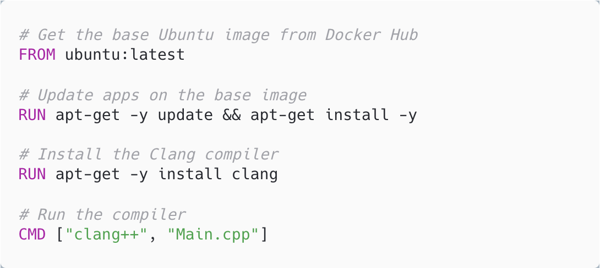
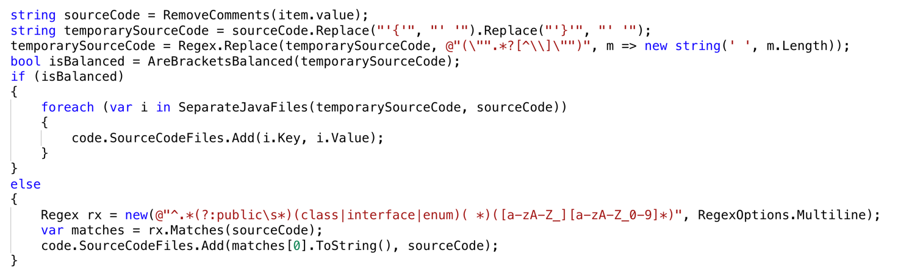

Table of Contents

- [Abstract](#abstract)

- [Introduction](#introduction)

- [Chapter 1: Online Code Compiler Service](#chapter-1-online-code-compiler-service)

  - [1.1 What is online code compiler](#11-what-is-online-code-compiler)

  - [1.2 What are the pros and cons of using such system](#12-what-are-the-pros-and-cons-of-using-such-system)

  - [1.3 What type of businesses can benefit from such tool?](#13-what-type-of-businesses-can-benefit-from-such-tool)

- [Chapter 2: What Technologies / Languages / Tools are used](#chapter-2-what-technologies--languages--tools-are-used)

  - [2.1 How does it work](#21-how-does-it-work)

  - [2.2 What are the problems](#22-what-are-the-problems)

  - [2.3 How reliable the system is?](#23-how-reliable-the-system-is)

- [Chapter 3: How does the system work](#chapter-3-how-does-the-system-work)

  - [3.1 Using Docker Technology](#31-using-docker-technology)

  - [3.2 Architecture of the system and program](#32-architecture-of-the-system-and-program)

    - [Endpoint (Controller)](#endpoint-controller)

    - [Logic Layer](#logic-layer)

    - [Running Java codes](#running-java-codes)

    - [Running SQL scripts](#running-sql-scripts)

  - [Start the Application](#start-the-application)

- [Chapter 4: Examples and Scenarios](#chapter-4-examples-and-scenarios)

  - [SQL](#sql)

  - [Java Database Example](#java-database-example)

  - [Java Multiple Public classes in single file example](#java-multiple-public-classes-in-single-file-example)

  - [C++ Fibonacci example](#c-fibonacci-example)

  - [Go Lang Factorial example](#go-lang-factorial-example)

  - [Python image plot example](#python-image-plot-example)

  - [C++ Timeout exception example](#c-timeout-exception-example)

  - [Java Error exception example](#java-error-exception-example)

  - [Python Error example](#python-error-example)

- [Conclusion](#conclusion)

# Abstract

Build a service that provides different online compilers that enables the user to run and compile codes remotely and get the results back instantly without affecting or disturbing other users' code compilation and flow.

# Introduction

A compiler is a computer program that translates computer code written in one programming language into another language (the target language). The name "compiler" is primarily used for programs that translate source code from a high-level programming language to a lower- level language (e.g., assembly language or machine code) to create an executable program.

Online compilers provide a user-friendly environment to write code on almost any internet- connected device and compile, run, and get the results back. The main advantage is that the device does not need to have all the compilers installed and correctly configured for different languages and versions.

There are different spheres where an online code compiler is useful starting with education field ending with job interviews, and many more use cases such as compiling a code snippet or even an entire project on a user's smartphone or a not so powerful device.

Compiling the code remotely can be convenient for the user; however, it can be challenging for the developer to build such a system considering all the security and code privacy measures. Scaling the infrastructure and provide a self-healing approach is one of the challenges of this system.

With the growing community of the developers, especially new and young learners there is a need to create more accessible ways to provide the same experience on low-end and mobile devices as they were powerful and capable computers.

It is expected to have a system which will provide an API (Application Programming Interface) which takes few parameters such as the language, the code, and when the input is needed, the input. Then the system takes all that values, process them, compile them, get back all the results do the necessary formatting and return the result.

For example, let’s look at simple python code which prints “hi”.

The body of the API request would be:

```
{

"language": "py",

"sourceCode": "print(\\"hi\\")",

"input": ""

}
```

Where the result would be: hi

Then the client can display it as desired.

At this level it seems a simple task, but further in the paper there will be more complex cases and more issues which will be addressed.

The focus of the paper will be on the infrastructure of this system and how it is built, what technologies are used and some demos what is capable of.

# Chapter 1: Online Code Compiler Service

## 1.1 What is online code compiler

The code compiler itself is a software which is developed by an organization or a person which translates the human written and understandable code into a machine code which the OS (Operating System) and hardware can understand and execute.

Every programming language that is ever used includes one. To use that functionality, the user needs to install it on the OS and configure few things to be able to use it.

Now image if there is a service which provides you the same functionality of a compiler but without any setup or configuration. You only need to send your code via a simple web request and get back the result in matter of seconds.

Of course, it adds some network latency, but the benefits are so much more that it worth’s the little wait for each code compilation and execution.

## 1.2 What are the pros and cons of using such system

The main downside is that it does not run locally, and some network transportation and latency is added over the usual code compilation and execution flow.

But the benefits are tremendous. First, you can use a powerful server to get the job done, and you also don’t need to worry about the hardware and keep your computer on for hours to get a huge code-base compiled and runned or tested.

All you need is a device which can send a network based (http) request. After sending your code, the service start working immediately, starts the compiling process and after that runs your code (parameters, flags and instructions can be given too) and returns the result.

When your process is finished, it automatically wipes the system and it’s ready for a new job. However, it is possible to run multiple processes simultaneously.

During this process your code can access remote resources over the internet, connect to databases and even upload files if needed.

## 1.3 What type of businesses can benefit from such tool?

Schools, universities, education platforms, online judge systems, interview platforms, open source community, enterprise systems and anyone who needs to run code can use and benefit from such technology.

For each business it can solve a different problem and it can be integrated at different levels.

For example, during Olympiads instead of setting up different compilers on every computer where students are going to use, they can setup a server run this service on it and provide a simple web page to send the codes for compilation.

There are different limitations for each case, but this is the golden middle of what benefits you can get how much resources should be spent to customize one end every computer to make them work exactly as desired.

# Chapter 2: What Technologies / Languages / Tools are used

In this chapter we will discuss how the system works, what type of problems it solve, how much extendable it is and bring some examples of the topics.

## 2.1 How does it work

At the first sight it looks like a simple task. Setup some compilers, write an API, and make them talk to each other. So, when the API gets the code (code, user inputs, flags, etc.) it saves it on disk, and run the compiler/run command and pass all the values to the compiler. The compiler builds the code, save the result on the disk again and the API reads the output and sends it to user. In fact, it is true, and this is basic description of what how the system works.

But with this simple approach we face some issues and difficulties that their solutions are not so trivial and brings value to this product.

## 2.2 What are the problems

Most of the problems occur when more requirements arise. Such as having more than one version of the same compiler, be able to connect to database, not be able to access other user codes that are running now on the same system, handle the non-text-based outputs such as media (such as files and images) and scale the system at any point.

For each one of them there is a solution, some of them needs little bit of coding and some are more of a configuration work and what chain of technologies to use.

Nevertheless, as the code isolation and privacy matters, we cannot just run all the requests in the same environment where users may access each other code or delete the files either accidentally or intentionally.

Let us demonstrate a scenario where it can be an issue. User A has written a code that saves a file in the root directory named secret.txt, containing confidential information.  
Meanwhile, user B has written a code where it checks if a file exists in the root directory with the \*.txt format, then it just reads the file instead of creating a one. In this case, user B has accessed user A's code and maybe not even getting his intended result from the code (user B has assumed that it should be empty by default).

Another case is where a malicious code can change some configuration, and the rest of the users will face a non-working service or, in the best case, a one that misbehaves. So, we need to cover such cases where the files during each compilation are isolated from the others.

Another case is compiler versions, their installations, and upgrading processes. If we intend to have a single server where the required compilers are installed, some issues may arise. The conflict between their configs, upgrading problems, and different versions are using some common files. For example, let’s say we want to support both python 3.6 and 3.10 versions, but there are not required to be available simultaneously. If we have some libraries installed, let’s say numpy, the same numpy version may not work with both versions of the python, so we need to handle all the libraries paths explicitly and when a new version added it may break everything again. So, as a solution we want to isolate each one from another and have one working version at a time which will not break at its own. Creating different VMs with desired OS, python version, and libraries will solve this issue, but it can be costly.

The network connectivity is yet another issue. In some cases, there may be a need to throttle the network where the code compiles. Some cases that come to mind are to prevent attacks from your servers to third parties and limit users from accessing some resources.

The issues and edge cases may increase if we go into details for each programming language. So, we need to give it a general solution that is not language-specific and can be applied to all scenarios, and in case of need, specific configurations can be made.

In the Chapter 3 we will cover these topics and provide solutions.

## 2.3 How reliable the system is?

One more thing that comes to attention is that how reliable the system is. How many codes it can run and for how long? How can we scale it? Can the system compile a C++ code while running a python script at the same time?

Yes, it can run multiple codes at parallel and based on the specification and the amount of the hardware it can handle as much as you want. As for the scaling, by using containerized solutions we can scale it very fast and in matter of seconds. It can also be configured to only provide 100 millicore CPU to each process, so based on the need it can be configured to handle as many compilations as required.

# Chapter 3: How does the system work

This chapter is the meat of this paper. We will cover all the solutions, tools, define how system works, how are they connected to each other, what problems they solve and how we utilize them for our benefit. To list the main ones we can mention, Docker containers, dotnet core, bash scripts and Linux commands. These are the main tools that are used to build this system. However, for some cases we go deep into configuration and use multiple tools to achieve them.

## 3.1 Using Docker Technology

This system is heavily dependent on containerization. Docker is the most popular tool for doing that. Let’s understand what it is, and how we are going to use it.

One way of solving this issue is to use the Docker containers. Docker is a set of platform as a service (PaaS) product that use OS-level virtualization to deliver software in packages called containers. Containers are isolated from one another and bundle their own software, libraries, and configuration files; they can communicate with each other through well-defined channels. Because all the containers share the services of a single operating system kernel, they use fewer resources than virtual machines.


Figure 1 - The difference between Docker and virtual machines

Docker can package an OS, application and its dependencies in a virtual container that can run on any Linux, Windows, or macOS computer. This enables the application to run in various locations, such as on-premises, clouds, or any type of computer. When running on Linux, Docker uses the resource isolation features of the Linux kernel (such as cgroups and kernel namespaces) and a union-capable file system to allow containers to run within a single Linux instance avoiding the overhead of starting and maintaining virtual machines. [Figure 1]

Because Docker containers are lightweight, a single server or virtual machine can run several containers simultaneously. This enables us to pack all the compilers individually and run them on a single server where our API code knows where to redirect each incoming request and with which instructions.

In other words, if we need to compile a C++ code, all we need is a docker image where the compiler is pre-installed and configured and can be run at any moment and shut down where the compilation ends.

In the following image, we are installing the compiler for the docker image. There are files called Dockerfiles containing the instructions on the steps on which files should be downloaded, extracted, installed, and configured. Let us look at a simple example of how Dockerfile is constructed. [Figure 2]



Figure 2 - Dockerfile sample of installing a compiler

Then by building this Dockerfile, we will get a docker image where we can run (docker container), provide the source code, and get the result.  
In this project, we build five different docker images for languages such as C++, Java, Go, SQL and Python. For each language we will set flags and parameters later.


Figure 3 - Dockerfile sample of using a prebuilt image

Here, we are using the pre-ready python image, which is based on a buster version of a Linux Debian distribution. Then we install some libraries and copy some files to that image. [Figure 3]

Similar steps need to be done for each language or version of the image, and each one will build separately. For example, if we want to have a similar python image but with a different version, all we need to do is to create another file and just change the first line where it states the version (python:3.10).

In this way we will have Dockerfiles which needs to be built to have the images which can be runned later.

Let’s follow these steps to create images:

1.  Create directories with the name of compiler languages. (e.g. python, cpp, java, etc.)

2.  Inside each directory create a file named Dockerfile with a similar content of the Figure 2 or 3 and add/edit all the changes.

3.  Now we need to build these images. To do that we need to execute the following command:

    docker build -t test-python:3 .

    Here the -t refers to the name of the image and stand for tag, and the character dot (.) at the end refers to the Dockerfile located in that directory. The file name is reserved by default. But we can name it differently and provide the exact file name and path instead of using the dot character.

4.  After building them we have all the images locally, but we need to upload them to the docker registry where it will be downloadable. To do this, we should specify the image name and tag: docker push test-python:3

5.  So now our image is available remotely and we can pull later to run them by using the following command: docker pull test-python:3

6.  To run the images the base command is: docker run test-python:3  
    But later will see more options and flags can be passed to get the container running with the correct parameters.

Here is the list of compilers and their libraries that are installed and the flags that will be passed to run the codes:

**C++**:

Compiler: GCC 10.2

Flags: g++ -Wall -fconcepts -pthread -std=c++17 -o /usercode/a.out

Libs: None

**Java**:

Compiler: OpenJDK 16

Flags: None

Libs: JDBC Driver

**Go**:

Compiler: Go 1.16

Flags: None

Libs: None

**SQL**:

Compiler: PostgreSQL 13

Flags: psql -U postgres -w -H

Libs: None

**Python**:

Compiler: Python 3.8

Flags: None

Libs: numpy 1.19, pandas 1.0.5, sympy 1.5.1, matplotlib 3.2.2, nltk 3.5

Each flag is responsible to set the output format, the version of the compiler, what librerry it should include and based in the needs they can differ. More details about these will be provided in the **Examples** chapter.

There is more on the docker part, which we will come back later in later sections.

## 3.2 Architecture of the system and program

Now that we have the primary tool under the hand, we can start constructing our application. The docker images of the compilers and their correct setup is the key part, the rest are the orchestration and process management which makes it possible and simple enough to run codes via a simple http request.

The API is going to be in .Net Core framework written with C\# language. This application itself will be dockerized at the end. Here, we are following the controller and business/logic layer pattern.

### Endpoint (Controller)

We will use different tools and technologies such as C\# .Net Core to write an API, and manage the source code files, Docker to build all the desired compiler images, and some bash scripting to manage the containers and configure some stuff.


Figure 4 - API documentation view

So, here the main parts are the language, sourceCode, and the input fields. Based on the language, we proceed further and load some configurations from our settings file. [Figure 4]

### Logic Layer


Figure 5 - The code snippet which determines the language and read the configs on how to compile the code

Here in the [Figure 5], we read all the configuraions (such as flags, docker image names, timeouts, etc.) and save them to a variable so the next steps can use them and pass it to the next steps.

Now let’s go into details of what are the main steps of this file. [Figure 5]

During the CreateProjectFiles step, we create a folder with randomly generated GUID, save the user's sourceCode and input under that directory, and copy all the auxiliary bash scrips we are going to need. [Figure 6]


Figure 6 – Directory creation and pre setup steps

Now that the files are ready, we need to start the compilation. BuildAndRun is the step where we pass all the data to the bash script, where in its turn, it runs the specific docker container (the ones that we built and pushed earlier) and attaches the newly created folder to that container (mounting the volume). The bash script now knows how to compile the code and what the limitations are. [Figure 7]


Figure 7 – Parameters and flags on how to run the code

For example, in the case of C++, the command is:

"g++ -o /usercode/a.out" and also it redirects the stdout and stderr to specific files, so our code knows where to get the results back later.


Figure 8 - Bash script which set constraints and time limit on containers

The bash script provides us with tools to set some limitations, such as file size and compile time. [Figure 8]

For instance, the ulimit is a built-in Linux shell command that allows viewing or limiting system resource amounts that individual users consume.

Here in the [Figure 8] we run the container with some resource limitations and save the process in the variable “cont”. Then wait till it compile or reach the time limit and kill the process and container. Here the “--rm” flag indicates that after exiting it will remove the container and its dependencies.

For different languages and compilers, we may adjust the limits. In some cases, like SQL, we need to pass greater timeout limit, because it takes longer to boot the SQL server rather than a simple python script which prints a text.

Now that the desired docker container is running with all the limits and mounted volume and passed parameters of compiler name etc., there should be a generic handler inside which actually run the command to compile the code.

Let’s have a look at the following bash script which is available inside every generated directory.


Figure 9 – The logic behind compiling the code and redirect outputs

The script above handles the execution cases for both compiled and scripting languages. It also supports the error cases and failed compilation errors and redirect them into the files which we later collect and concatenate together to display to the clients. [Figure 9]

For example, in case of python we may have few lines of code but there is something wrong at the last line. This smart way of collecting both the output and errors let us have them both. Example on this in the last chapter.

There may be cases where the user has generated a big output. Let us say the user-generated a random text file which is around 1GB. If we return that as an output, it may degrade the server performance and also hurt the client-side too, where all that data should be downloaded. So, it is important to handle such cases too. We will limit this by trimming the output text when it reaches our output size limit.


Figure 10 - Bash script, which checks the output size and trims if needed

The following part checks the file size, and if it is bigger than 100KB, it will only take the first 2048 chars, and because most probably the code was an infinite loop, it will remove and replace the error with "Execution Timed Out!" message. [Figure 10]

Here we solved the output size of the text-based results at the compiler level before even the C\# code read back the output. This way we unloaded some computational weight from the C\# processing with a quick hack of trimming the text. Now, C\# part of the code will collect all the outputs and errors in the correct order and set them to return to the user. [Figure 11]


Figure 11 – collect all the outputs, combine them and return as a unified output

There will be cases where there is a media output, such as images. Let’s see how we read back and send the response to the client and what we do in case of media files.


Figure 12 – Handle image as an output

Here we search for a PNG file format in all the sub directories, check the image size, if it is bigger than the limit of 5MB, we throw an error, if not we upload it to a blob storage and get back a URL and return it back to the user. [Figure 12]

In the end, our C\# code gets notified when the compilation is done and go gathers all the output files. If needed, some modifications are done, and the result is sent back to the user.

It sends back a JSON object so the client can render the view based on its needs. For example, it can create an HTML template and insert in the values to customize the view.

It is also worth noting that when a directory is attached to a container, the access is limited to that directory and its subfolders. So, the directories created by different users (each request generates a new GUID folder) cannot be accessed.

We are also setting time, CPU, memory, and storage limitations on each container to be fair for all users, and each one will get enough resources to run their code online.

So, the user sends a code via API request, the API takes the data, creates a new directory, save all the files inside and copy some scripts into that folder. Load the configurations and pass it into a bash script. The bash script takes all the parameters such as the docker image name, time limit, and all the compilation flags. It runs the docker container while mounting it to that directory where all the files are located. Inside the container the second bash script handles the inputs, outputs and errors, run the commands and at the end if needed trim the results and finishes its job. The API code which runned the process get notified that the task status is exited and starts collecting the data from the same directory. All the names for outputs and errors are predefined so it follows some logic to merge them together. It also checks for media files, if available and size is not big, it uploads it into a remote storage and get back the link. At this point all the data from the directory collected and loaded in C\# so it safe to free up the disk space and deletes the directory. The output data is ready and it will be returned to the client.

Our API which is written in C\# is working inside a docker itself and is capable of running docker images (such as python, etc.) inside itself. This is called DIND (Docker in Docker). Using this method helps us to be able to create as many instances of this system as we want. All we need to do is run yet another instance of the main docker image and based on the available hardware, it now handles much more requests. [Figure 13]


Figure 13 - API containers running compiler containers inside them

Almost all the languages behave similarly with minor exceptions and flags. Some of them require a little bit much memory to run and beside that they are similar. Here we will cover some interesting sections of the languages that are used.

### Running Java codes

#### Find Java Main Method

As you may know in Java, the java file name should be always the same as a public class name. But we wanted to let the user choose the public class name where they don’t have access to set the file name. So, we used a java cli command named “javap” which disassembles one or more class files.


Figure 14 – Java main method discovery

It finds all the files ending in .class extension, then inside them tries to search for the one of the four variants of the main method and passes that file to the java command to run the file. [Figure 14]

#### Multiple public classes in single file

We also know that Java won't allow more than one public class in a single Java source file. But we wanted to get rid of that limitation too. So, we added another processor for java code which handles this. The user is able to submit a file with more than one public classes and the codes parse the code and separate them into different files underneath where the “javap” then helps to find where is the main method located.

Let’s understand the details and how we did that. We are using regular expressions (regex) and C\# string methods to find the lines which are commented out, remove some characters, then check if brackets are not balanced then it just saves it to a file because it is not possible to know where to separate from and we let the java compiler throw an error and let the user know about the mistake. If the brackets are even, then we proceed further and iterate over the code to find opening and closing position of all the classes and when all the checks are done then separate them into different files and save them. [Figure 15]



Figure 15 – Java creates multiple files based on public classes

More examples on this multiple public classes in single file in the last chapter.

### Running SQL scripts

For running the SQL scripts we are using PostgreSQL. It has some requirements like setting a password for the database. So, we pass the password during running the container.

PostgreSQL let you set the output format. So, we configure it in Dockerfile that it will always output as an HTML then we pass it into an already predefined HTML file which contains CSS styles.

We pass the following flags: "psql -U postgres -w -H"

The “-U” passes the database username, “-w” is saying that do not require password while connecting to the database locally, and the “-H” says that output as an HTML.

While executing SQL, we faced a weird behavior that it always lasted 10 seconds no matter how simple or complex the queries were. It tured out that the psql has a default timeout of 10sec and because we overridden some scripts to make it work in this envirmenoment, now we need to explicitly say that when you exectutin is done, send the exit status. The command for that was: "pg_ctl stop -m immediate"

This solved the waiting problem of the default waiting timeout.

For the style part, we created a default HTML file with loaded styles. There is a placeholder text in that document, and when the result is available, by suing the following command we replace it into that document: [Figure 16] [Figure 17]

Figure 16 – Find and replace the output in HTML doc

Where the HTML file is:

Figure 17 – HTML template for SQL outputs

Later we will see some code examples and results.

## Start the Application

Now that we know what the internals of the system are, what are the components and how we handle some edge cases, let’s see how we can start the application so it can setup itself and ready to receive requests.

As we mentioned earlier, we created docker images for each language. They need to be uploaded to a docker registry where we can pull the images later.

For that we have a bash script which take care of authenticating, pulling and running the dotnet backend of this service.

Here is the script:


Figure 18 – Applications start shell script

As previously mentioned, we use DIND. That is because we need to run the compiler images inside of our container to be fully scalable and provide isolation.

So, we run the “dockerd” (docker daemon) in background by using the & command.

Next, we need to pull docker images. But before that we have to authenticate to be able to pull them. So, we save the password into a text file, then by using Linux pipes pass the password into the command where it logins and then removes the text file containing the password.

Then it pulls the images one by one and at the end for security reasons it removes the docker config file which contains the password. [Figure 18]

After that it creates an empty file and start the main application. We use the empty file named “running” to identify if the image pulling has finished and we are ready to steer traffic into the service.

This method is used to prevent sending traffic to a service which is not yet ready to handle requests.

# Chapter 4: Examples and Scenarios

In this chapter we will go over some examples of compiling or running different languages.

## SQL

Let’s create a database and some tables, insert some values and execute a query to get the data back.


Figure 19 – Sample SQL script

Here we create database and tables, insert the values and execute a query at the end. [Figure 19]

Ok, now let’s see the result:


Figure 20 – SQL output result

As you see the output is beautifully styled with CSS and all the commands and their results are visible. [Figure 20]

We can also get the output on mobile device: [Figure 21]


Figure 21 – SQL output result on mobile

## Java Database Example

Here in Java code example, we want the code to work with database. We have the option to use either a database which is available via link, or create one inside the container.

Let’s have a databse locally and then connect the Java code to it.

For that we need to install the SQLite and the required JDBC driver inside the Dockerfile. We will download the JDBC driver, put it in the directory and inside Dockerfile we will copy that driver into the image. We also need to append this jar file into the classpath so it will recognize the library.

Dockerfile: [Figure 22]


Figure 22 – Java Dockerfile for database connections

Now when the java code runs, we need to attach this part to java command: [Figure 23]


Figure 23 – Java JDBC driver classpath

So, now that the driver is setup, we can go to the Java code part and connect it to the database.


Figure 24 – Java code to connect, insert and select from DB

Here the code is setting up the DB connection, and execute few commands which we see the results. [Figure 24]

The result would be: [Figure 25]


Figure 25 – The output of the Java DB flow

##

##

## Java Multiple Public classes in single file example

In small example we will see how Java file separator works in case of multiple public classes in source code. [Figure 26]

Here is the Java code:


Figure 26 – Java multiple public class in a single file example

When we compile and run the following code, we will get the following output:

_Hello from Public One!_

_Hello from Public Two!_

But if run the same exact code in any other Java compiler we will get the following error:

_PubClassOne.java:10: error: class PubClassTwo is public, should be declared in a file named PubClassTwo.java_

_public class PubClassTwo_

We got the expected error here and you can see that it complains on the second public class placed in the other file.

## C++ Fibonacci example

Here we want to run a Fibonacci calculator by taking a user input and compile the code.


Figure 27 – C++ user input popup

Here we pass an input and send the request. [Figure 27]

The body of the request contains the code and user input. After compilation, it returns the result which is 5 in case of input 5 and 13 when the input is 7.

## Go Lang Factorial example

Here we want to write a Factorial calculator in Go language. This can also take a user input. But this time we will do it from a mobile device for demo purposes.


Figure 28 – Go lang factorial calculator output on mobile

Here in the popup, we inputted number 8. As you can see in the code the output matches what is written in code and the input is dynamic. [Figure 28]

## Python image plot example

In this example we want to use python and by including some libraries be able to output an plotting image of a sin(x) function.


Figure 29 – Python image plotting output

As you can see it plotted the values and provided an image. We can plot anything by using the required libraries and right datasets. [Figure 29]

## C++ Timeout exception example

In this example we want to demonstrate the case where code throws a timeout exception because it reached the limit of how long a code can run. This works for both time and size-based outputs. [Figure 30] the code part responsible for this behavior can be found at [Figure 9].


Figure 30 – C++ timeout exception output

## Java Error exception example

In this example we will write a java code to check the number is prime or not. But intentionally we will leave few errors in the code. Let’s see the result.


Figure 31 – Java multiple errors output

As expected, it returned all the errors as normal compiler would do. We can check the code, try to fix them and rerun to find if any more errors remain. [Figure 31]

## Python Error example

As we already know, Python in interpreted language, that means it can run few lines by success and fail at the next line.


Figure 32 – Python code output and error

This shows that our service is capable of collecting all the results and combine the outputs and errors together. [Figure 32]

# Conclusion

By way of conclusion, with growing E-Learning platforms and the need of more accessible and user-friendly tools for programming, online compilers come for help. As we saw in the examples in this paper it was promising and can be configured to work with many different languages and scenarios. Using such service is beneficial for many cases but mostly for the beginners and cases where the environment needs to be controlled.
